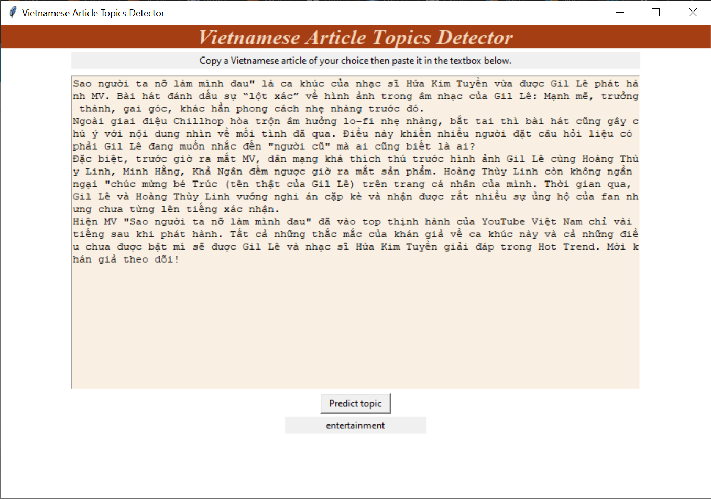

# NLP
## Vietnamese news topic classifier
The goal of this project is to predict which topic an article belongs to. Training and testing data is scrapped from a Vietnamese news website. Data is transformed to easily digestible format. Then, the trainsformed data is used to train various machine learning models. Each model will be evaluated to measure their performance.
We scrape articles from vnexpress.net, the most well-known digital news site in Vietnam. 

Source of news articles used to retrieve training dataset: [vnexpress.net](https://vnexpress.net/)

### Setup
Requirements
* Python3
* git

```shell
git clone https://github.com/tiendatngcs/NLP.git
cd NLP
python3 ArticleReader.py
```
### Application interface


### Prediction model metrics of performance

